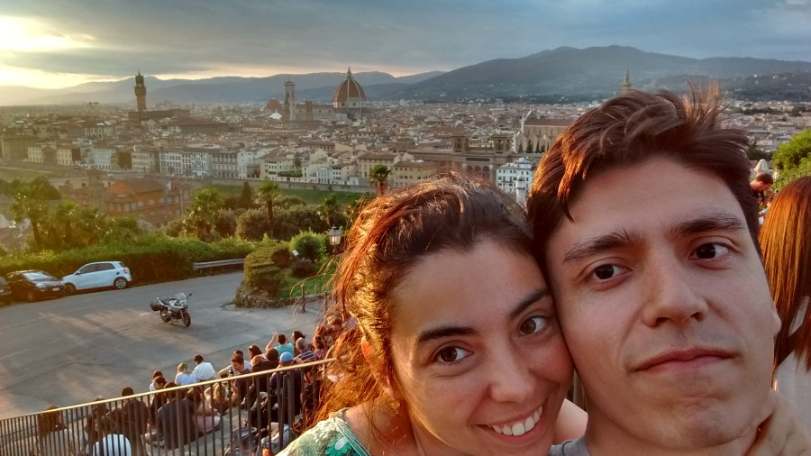
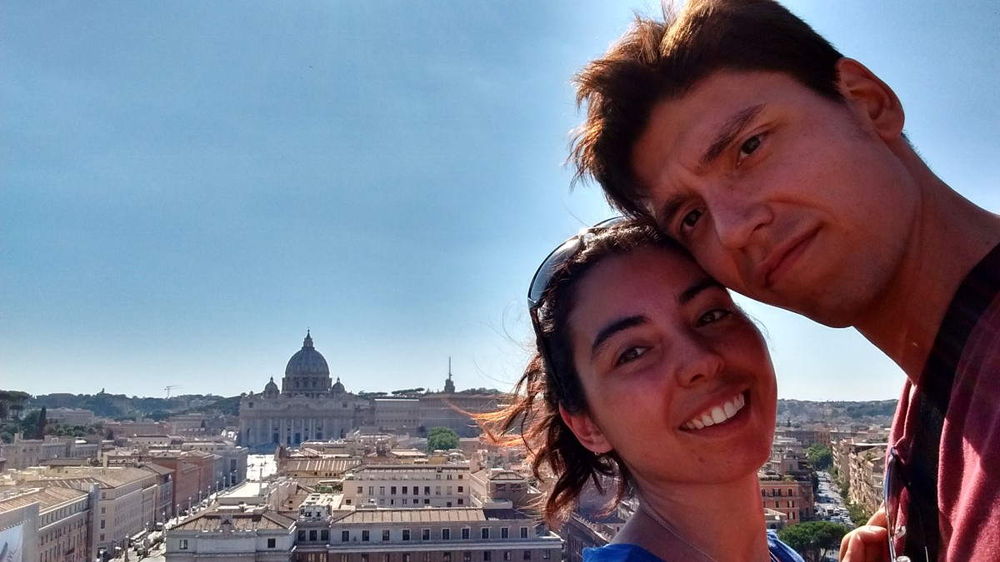
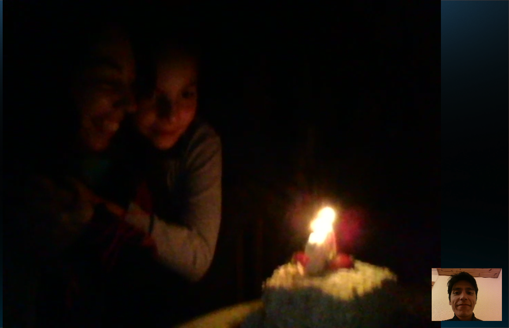
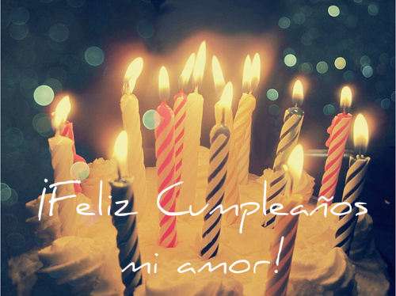

### Preciosa mía:

Una vez más te deseo muchas felicidades en el día de tu cumpleaños. Como ya te lo he dicho en otras ocasiones, te deseo lo mejor en cada aspecto de tu vida. Quiero que seas infinitamente feliz y yo ser parte de esa felicidad. Esta vez quise hacer algo un poco distinto y espero que sea de tu agrado. En lugar de comprar y enviar una tarjeta física, quise crear mi propia tarjeta, sólo que esta vez la hice electrónica en lugar de física, pues creo soy un poco más diestro manipulándo código que trozos de cartón. Pensé que podría ser una buena alternativa además dada las condiciones dadas por la lejanía. Así, al menos esta vez esto será mi regalo <i>hecho con mis propias manos</i>. De esta manera quise dejar plasmado aquí mis sentimientos hacia ti en esta fecha tan especial al alcance de un click. Espero que te guste. &#x2764;

Tengo sentimientos encontrados. Por un lado me siento feliz y afortunado de verte cumplir un año más a mi lado y por otro, me duele no estar junto a ti y celebrarte como quisiera, con abracitos y cariños y besotes; regaloneándote mucho, tal como en la foto de arriba en tu primer cumpleaños aquí. Nos vemos tan jóvenes e inocentes jajajaj (y con tan pocas cosas en la mesa jajajaja) y eso que fue sólo hace un par de años... ¡Cómo añoro que estuviéramos así ahora!, pero bueno, al menos puedes aprovechar de celebrar con tu familia y nuestros amigos, que sé que es importante también, así que más sentimientos encontrados &#x1f605;. Ha sido un año lleno de aventuras, alegrías y aprendizaje, pero también a veces con preocupaciones y dificultades. Y bueno, con una prueba a la que nos enfrentamos por primera vez, el vivir separados por un tiempo prolongado. Pero lo más importante es que al final todo es parte de nuestro crecimiento juntos y eso me encanta. Miro hacia atrás y no me arrepiendo de nada, al contrario, me hace feliz visualizar todo lo que hemos recorrido y logrado juntos. Y quiero que sepas que espero que siga así para siempre. 

Espero también que tú lo sientas así y aprovecho de pedirte perdón por los momentos en que quizás he fallado, muchas veces sin darme cuenta, pero justamente una de las fortalezas de nuestra relación es que podemos conversar las cosas y llegar a soluciones. 

 Hermosa. Sí, así eres y así siempre has sido y serás. Tal y como te ves en esta foto, que nos sacamos en el que creo uno de los momentos más especiales que hemos tenido en el último año y por eso quise recordarlo y mencionarlo. Primero, porque fue espontáneo, no fue planeado, fue una decisión del minuto el ir a ese lugar que resultó mágico. Nos encontramos con lo inesperado, un paisaje espectacular y en el momento preciso. Pude sentir cómo nos conectamos, cómo el lugar y la escena nos provocó la misma reacción, y lo disfrutamos muchísimo. Además sentí que nos trajo mucha paz: el tiempo se detuvo y a pesar de que el sol se movía, nosotros nos detuvimos. Pudimos como muy pocas veces, parar olvidarnos del mundo, de los tiempos, de las responsabilidades y disfrutar el momento. Creo que será un recuerdo imborrable que llevaré por siempre en mi corazón. Y espero que para ti también lo haya sido.

 Esta foto también me gusta mucho. Aparte de que nos vemos guapos, salimos pegaditos como mirando hacia el futuro. Me gusta porque para mí representa lo que se viene. Lo que quiero que venga para nosotros. El futuro junto a ti. Muchos años más, muchos cumpleaños más juntos ya sea aquí o allá o donde sea. Quiero que sepas que aunque quizás a veces tengamos ideas diferentes de lo que queremos para más adelantes o nuestro sueños o futuro ideal, en mis visualizaciones siempre estás tú. Y mi idea es que podamos seguir el camino en que se cumplan la mayor cantidad de nuestros de deseos.

 Finalmente quise agregar este momento para que quede registrado aquí también. Lo acabamos de vivir hace poco: la celebración con el canto oficial. No pude estar físicamente ahí, pero mi corazón, mi mente y mi alma estuvieron contigo en ese momento, tal y como siempre. Me alegra que al menos por un instante pude entrar a tu casa y compartir con tu familia; ser parte de el grupo, cantarte y celebrarte. Ver con mis propios ojos cómo fue aquel momento tan importante para ti y para mí. <b>¡Feliz cumpleaños mi amortín!</b> y que cumplas muchos muchos más, que yo me encargaré de que los vivas feliz y de la mejor manera posible.

## ¡Te amo por siempre!

